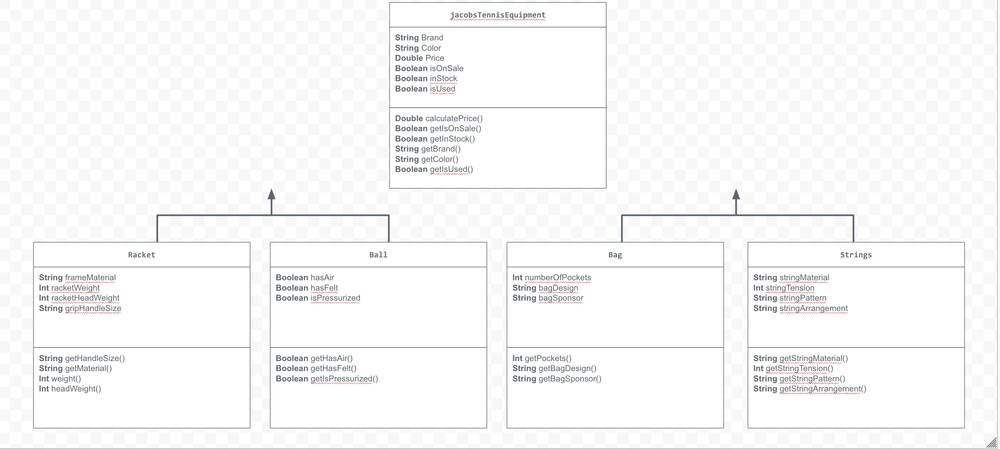

## UML Diagram

## Description

The store I create for my project was a tennis store that sells equipment such as strings and rackets. I represented items by creating subclasses and superclasses that helped represent different tennis equipment. The attributs of the equipment were represented by the instance variables that I created within the classes. The user interacts with my store by selecting which category they want to store: Tennis equipment, rackets, or strings. It then asks them questions such as if the equipment is used, what the brand is, what the price is, and how much of the item the person is buying. For subclasses, more specific types of attributes are asked for such as the material of the strings, and the color of the racket. After the user inputs all the information the program needs, the program will output what the user inputted into the console. 
